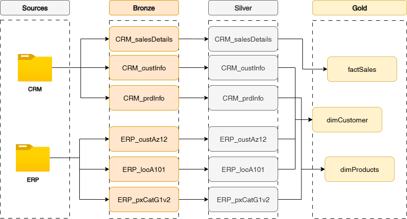

# DATA WAREHOUSING PROJECT IN SSMS

## Project Overview

This project implements a simple Data Warehouse (DWH) architecture using SQL Server and SQL Server Management Studio (SSMS). It adopts a layered approach (Bronze → Silver → Gold) to data processing and transformation for better modularity, maintainability, and performance optimization.

The primary dataset is sourced from a structured CSV file containing transactional data. This dataset is imported manually or using custom Stored Procedure (SPs) into the Bronze layer, where raw data is stored. The Silver layer applies data cleansing, filtering, and enrichment through Stored Procedures (SPs). The Gold layer aggregates and summarizes the refined data into business-ready views, which serve as the foundation for reporting and analytics in tools such as Power BI or Excel.

## Project Goals
- **Automate Data Loading and Transformation** : Build a repeatable data pipeline using SQL stored procedures to load, clean, and transform data from raw to report-ready format.
- **Enable Scalable Data Layering** : Adopt the Bronze-Silver-Gold model for structured and scalable data processing.
- **Provide Reproducible Setup** :Ensure that the schema, stored procedures, and views are clearly versioned and documented for consistent deployment across environments.
- **Leverage Native SQL Server Tools** : Use SQL Server, SSMS, and T-SQL to create and manage the data warehouse, ensuring compatibility with existing enterprise environments.
- **Deliver Business Insights via Reporting Layer** : Create views in the Gold layer tailored for business stakeholders, focusing on KPIs like total sales, sales by region, and performance trends.

## Tech Stack
1. SQL Server	
2. SSMS	
3. T-SQL

## Project Documentation
`Data Model`

`Data Flow`

